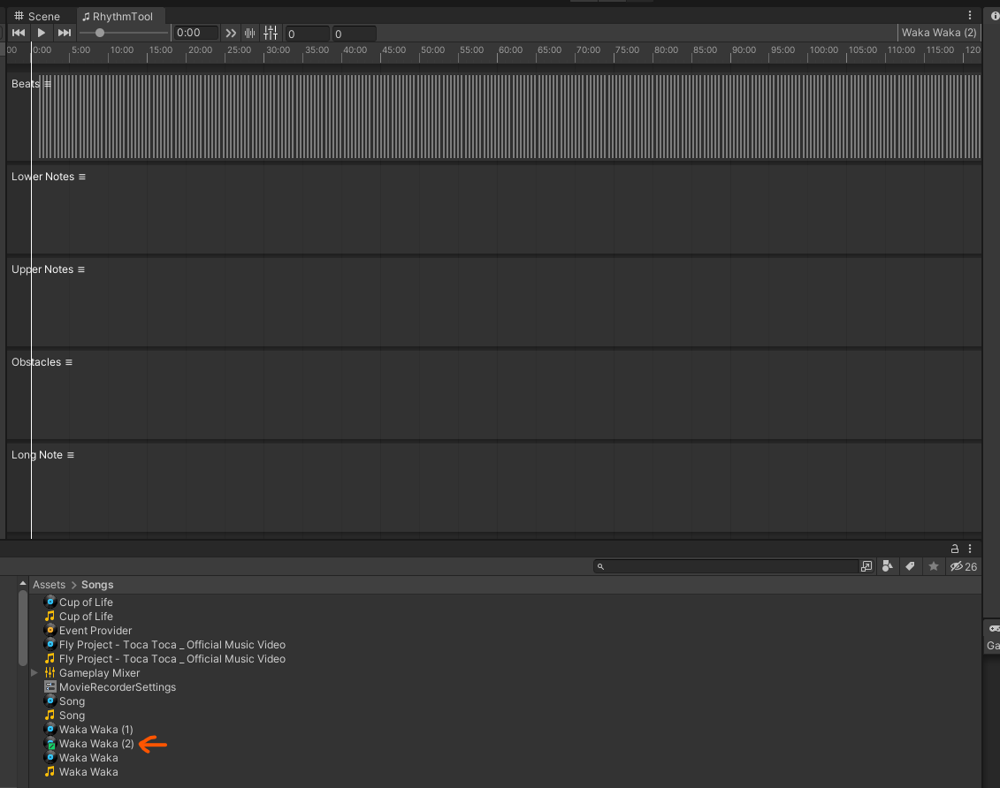

# How to create new beat-map

1. Create a new analyser game object on scene beat-map editor need it to analyse beat.

2. Right click on the audio file in unity editor, under "RhythmTool" select "Create beatmap". (see @RhythmTool.EditorAnalyzer.CreateBeatmap )

3. Double click on the newly created rhythm data file, the beat-map editor should popup like this.

4. When editor tab is focus on "RhythmTool", the following shortcut keys apply:
   
   - Ctrl + ← / → : move to last/next beat (will not work if no Beats track or data exists)
   - Ctrl + Space : spawn a note on the current selected track (won't work if no track is selected)
   - While dragging note(s), Hold Shift to enable snap mode, it will snap the first note to current pointer position on the timestamp 