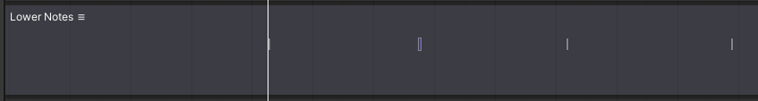
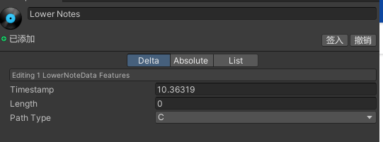
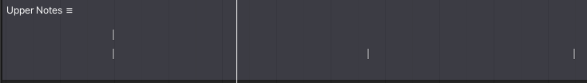
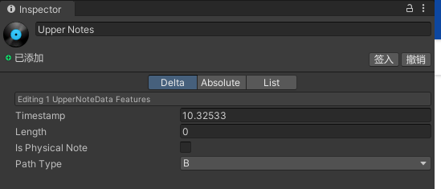

## Lower note track

(see @RhythmTool.LowerNoteTrack and @RhythmTool.LowerNoteTrackGUI )

The lower layer of note tracks contain 4 different path type (see @RhythmTool.LowerNoteData.pathType ),
each can be map to different or same path according to (see @DDVRKick.Tracks.TracksManager.lowerTracks ).

(see @RhythmTool.LowerNoteData )

This note should only use its timestamp to map its own position on the song timeline.

## Upper note track

(see @RhythmTool.UpperNoteTrack and @RhythmTool.UpperNoteTrackGUI )

The upper layer of note tracks contain 4 different path type (see @RhythmTool.UpperNoteData.pathType ),
each can be map to different or same path according to (see @DDVRKick.Tracks.TracksManager.upperTracks ).

(see @RhythmTool.UpperNoteData )

This note is like lower note but have an extra setting of being a physical note (see @RhythmTool.UpperNoteData.isPhysicalNote ).